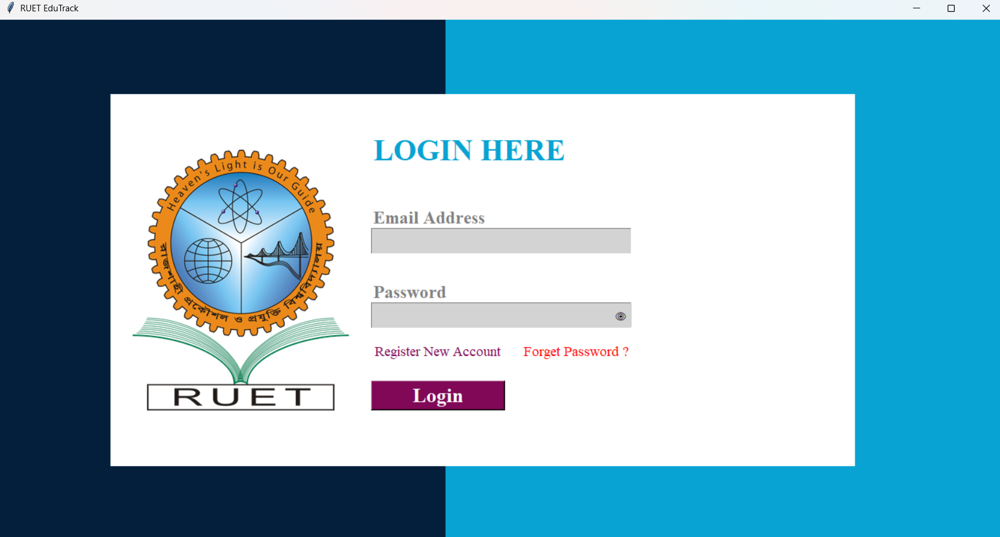
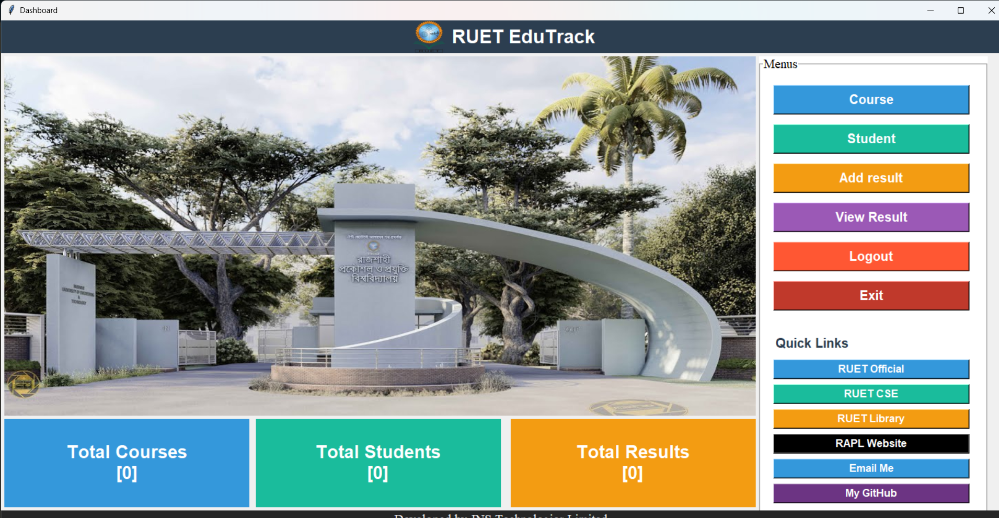
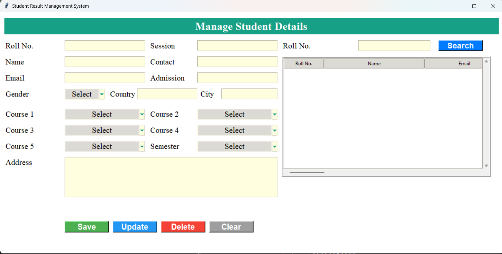
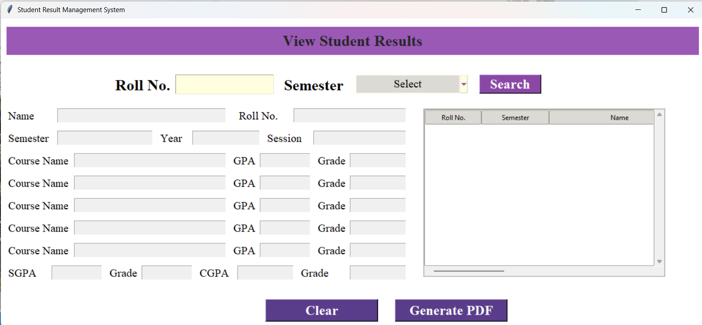

# 🎓 RUET EduTrack

> **A Comprehensive Student Result Management System for Rajshahi University of Engineering & Technology (RUET).**


## 📖 Overview

**RUET EduTrack** is a desktop-based education tracking system developed to streamline academic management. It allows administrators to manage student details, course information, and academic results efficiently. The system features a secure login with OTP recovery, automated CGPA calculation, and PDF report generation.

## ✨ Key Features

* **🔐 Secure Authentication:**
    * Admin Registration with security questions.
    * Login system with encrypted password handling.
    * **Forget Password:** Email-based OTP verification for password resets.

* **📊 Dashboard:**
    * Real-time counters for Total Courses, Students, and Results.
    * **Quick Links:** Instant access to RUET Official, RUET CSE, Library, and RAPL websites.

* **📚 Academic Modules:**
    * **Course Management:** Add, update, delete, and view course details (Code, Credit, Teacher).
    * **Student Management:** Register students with personal details, session, and semester enrollment.
    * **Result Processing:** Automated GPA/CGPA calculation and grading (A+, A, etc.) based on course credits.

* **📄 Reporting:**
    * **PDF Generation:** Generate downloadable result sheets for students using `fpdf`.
    * **Search:** Filter results by Roll Number and Semester.

## 📸 Project Snapshots

*(Please upload your screenshots to a `screenshots` folder in your repository)*

| Login Screen | Dashboard |
|:---:|:---:|
|  |  |

| Student Entry | Result Sheet (PDF) |
|:---:|:---:|
|  |  |

## 🛠️ Technology Stack

* **Language:** Python 3
* **GUI:** Tkinter (Standard Python Library)
* **Database:** SQLite3
* **Libraries:**
    * `Pillow` (Image Processing)
    * `fpdf` (PDF Generation)
    * `smtplib` (Email/OTP Services)

## 🚀 Installation & Setup

1.  **Clone the Repository**
    ```bash
    git clone [https://github.com/NAJMUL-NAHID/RUET_EDU-TRACK.git](https://github.com/NAJMUL-NAHID/RUET_EDU-TRACK.git)
    cd RUET_EDU-TRACK
    ```

2.  **Install Dependencies**
    ```bash
    pip install pillow fpdf
    ```

3.  **Initialize Database**
    Run the script to create the required tables (`student`, `course`, `result`, `employee`):
    ```bash
    python create_db.py
    ```

4.  **Run the Application**
    Start with the login window:
    ```bash
    python login.py
    ```

## 📂 Project Structure

```text
RUET_EDU-TRACK/
├── create_db.py      # Database initialization
├── login.py          # Authentication & OTP Logic
├── register.py       # Admin Registration
├── dashboard.py      # Main Menu & Quick Links
├── student.py        # Student Data Management
├── course.py         # Course Data Management
├── result.py         # Result Entry & Calculation
├── report.py         # View Results & Generate PDF
├── images/           # Assets (logo_ruet.png, etc.)
└── screenshots/      # Project Screenshots
